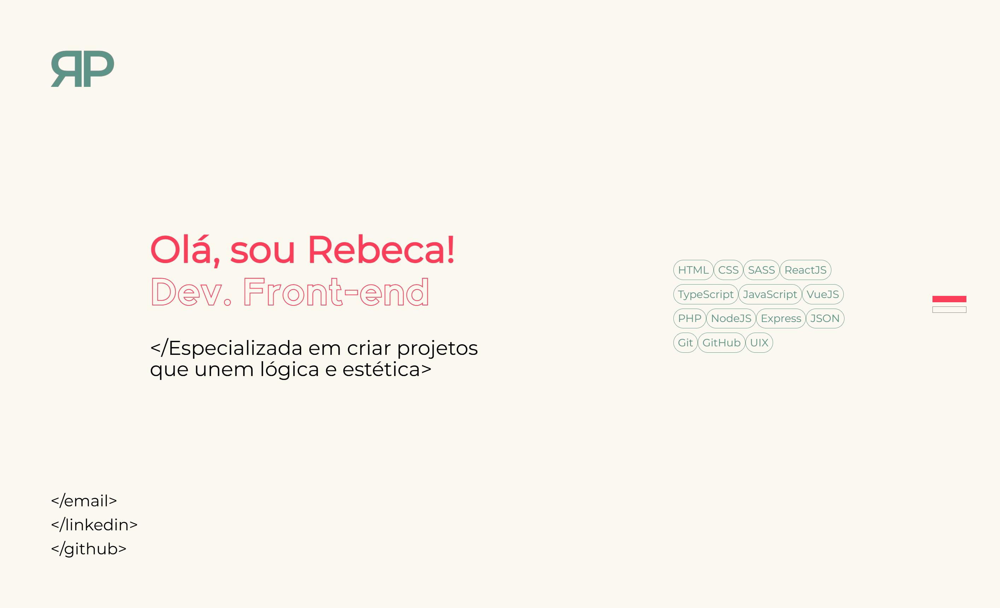

# Portfólio | Rebeca Parreiras

Portfólio contendo os meus principais projetos focados no Desenvolvimento Front-End.

  

## Tecnologias
  
          
          
          

## Projetos
<ul>
  <li>Visionary | <a href="https://github.com/rebecaparreiras/visionary">GitHub</a> | <a href="https://visionary-production.up.railway.app">Deploy</a></li>
  <li>Visionary ReactJS | <a href="https://github.com/rebecaparreiras/visionary-react/tree/main">GitHub</a> | <a href="https://visionary-react-production.up.railway.app">Deploy</a></li>
  <li>Kern Studio | <a href="https://github.com/rebecaparreiras/kern-studio">GitHub</a> | <a href="https://kernstudio.com.br/gallery">Deploy</a></li>
  <li>English Tutoring | <a href="https://github.com/rebecaparreiras/english-tutoring">GitHub</a> | <a href="https://english-tutoring-production.up.railway.app">Deploy</a></li>
</ul>
