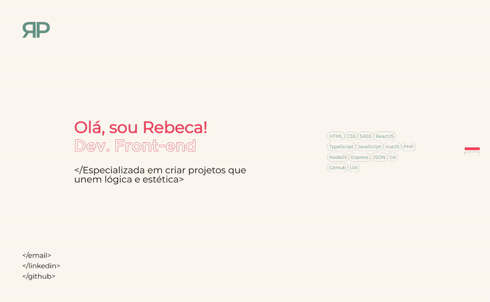

# Portfólio | Rebeca Parreiras

Site portfólio contendo os meus principais projetos focados no Desenvolvimento Front-End. 

  

 

## ReactJS 
O site foi construído utilizando ReactJS + TypeScript no ambiente Vite. Dividido nos componentes Header.tsx, ProjectCard.tsx, ProjectsCarousel.tsx e SliderNav.tsx, e nas páginas IntroSection.tsx e ProjectsSection.tsx. 
  

## SASS
Foi uma oportunidade rápida e simples de testar pela primeira vez e aprender sobre SASS. Após entender todos os conceitos e colocar em prática, percebi que SASS é mais funcional para projetos e equipes maiores que precisam de padrões consistentes ou com design system grande. Para este projeto, CSS Modules ou Tailwind seriam mais do que ideais, já que o passo extra de build para o SASS não compensa. Ainda assim, pude aproveitar a oportunidade para aprender uma nova tecnologia.
  

## SliderNav.tsx
Cria uma <a href="https://github.com/rebecaparreiras/portfolio-2025/blob/main/src/components/SliderNav.tsx">barra de navegação lateral</a> em forma de slider que passa de uma página à outra. Para isso:

### Estado 'active'
Utilizei o estado 'active' para guardar o ID da seção visível na tela. Inicia vazio (''), mas assim que o usuário rola a página, esse valor muda para o ID da .page atualmente visível. 

### useEffect
Ao montar o componente:
<ul>
<li>Pega todos os elementos com a classe .page;</li>
<li>Cria um IntersectionObserver que escuta quando cada seção entra ou sai da tela;</li>
<li>Quando uma seção está visível em pelo menos 50% (threshold: 0.5), ele atualiza o estado 'active' com o ID dessa seção;</li>
<li>Começa a observar todas as seções;</li>
</ul>

Ao desmontar o componente:
<ul>
<li>Remove a observação de cada seção e desconecta o 'observer'.</li>
</ul>

### handleClick()
Criei uma função handleClick() que é chamada quando o usuário clica em um dos links da navegação lateral entre páginas, prevenindo o comportamento padrão do link e encontrando o elemento da seção pelo ID, tudo isso com scroll suave até a seção seguinte.

### Renderização
Renderiza uma barra de navegação com links para duas seções:
<ul>
<li>#page-1</li>
<li>#page-2</li>
</ul>
O link recebe a classe 'active' se o ID da seção visível for igual ao do link. 
  

## ProjectsCarousel.tsx
Utilizei o Swiper para a criação de um carrossel para a apresentação dos projetos. Os apresentei dessa forma tendo em mente a ideia mobile first, uma vez que permite a apresentação de diversas informações em um espaço pequeno de tela. 

Para cada item do array 'projects':
<ul>
<li>Cria um SwiperSlide com aria-label para acessibilidade;</li>
<li>Dentro do slide, renderiza um ProjectCard.tsx mostrando título, descrição, stacks, link do projeto e link do GitHub;</li>
</ul>

### Acessibilidade
<ul>
<li>aria-label="Projects carousel" para descrição;</li>
<li>aria-label={ Projeto ${p.title} } para descrever o conteúdo;</li>
</ul>
 

## Tecnologias
  
  
          
## Projetos
<ul>
  <li>Visionary | <a href="https://github.com/rebecaparreiras/visionary">GitHub</a> | <a href="https://visionary-production.up.railway.app">Deploy</a></li>
  <li>Visionary ReactJS | <a href="https://github.com/rebecaparreiras/visionary-react/tree/main">GitHub</a> | <a href="https://visionary-react-production.up.railway.app">Deploy</a></li>
  <li>Kern Studio | <a href="https://github.com/rebecaparreiras/kern-studio">GitHub</a> | <a href="https://kernstudio.com.br/gallery">Deploy</a></li>
  <li>English Tutoring | <a href="https://github.com/rebecaparreiras/english-tutoring">GitHub</a> | <a href="https://english-tutoring-production.up.railway.app">Deploy</a></li>
</ul>
